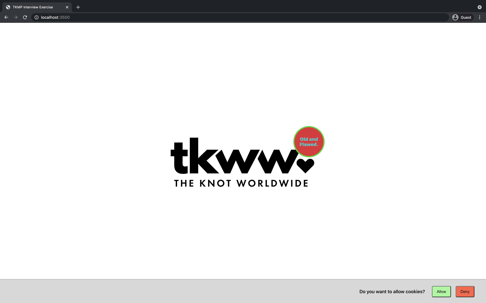
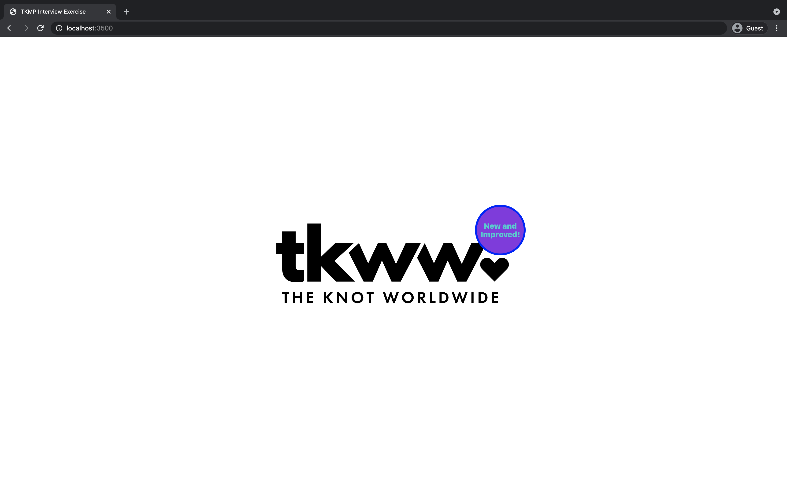
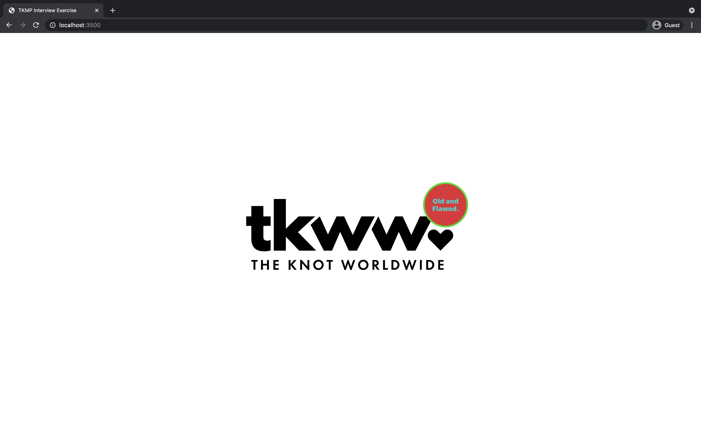

# The Knot Marketplace Interview
## Background

Take a moment to familiarize yourself with the application.

The goal of the application is to have a consent pop up from the bottom.\
When a user selects 'Allow', they will be able to randomly assigned into an A/B test.
If they select 'Deny', they should not be assigned a test group.
### First Visit


|                  Test Group                  |                    Original Group                    |
| :------------------------------------------: | :--------------------------------------------------: |
|  |  |


---
For our team to review your work, we will be checking out a branch titled `FIRSTNAME_LASTNAME`.\
Once complete, we will commit your code and then push to origin. Although committing your work is a part of this exercise, we make sure to remind you when we are done.

---
Each component of the application is wrapped in an `displayErrorWrapper` higher order component. These will help you with debugging. If you notice them in the UI, you may click them to see both the component stack and the call stack of the error. The developer tools console and network tab may also be helpful.
 |              Error Button              |
 | :------------------------------------: |
 |  |

---
All code changes will be within the `packages/app/src` folder. All other directories can be ignored.

There will be no CSS, HTML or Markdown changes in this exercise. All parts can be solved using only Javascript or Typescript. Typescript is not required.

You may notice `className` being assigned to components: no part of this exercise requires any modification of a `className` prop. Modifying a `className` may result in the application displaying in an poor state.

---
## Exercise
To run the application, clone this repository and run the following from the root of the application.
```
> yarn
> yarn start
```
Using [VSCode](https://code.visualstudio.com/) or [Atom](https://atom.io/) as your IDE is advisable for this exercise.

---
## Requirements
This exercise requires both `node` and `yarn` to be installed on your local machine.
### Node Install
#### **macOS**
- HomeBrew
  - `brew install node`
- cURL
  - `curl -o- https://raw.githubusercontent.com/nvm-sh/nvm/v0.35.3/install.sh | bash`
- Web
  - Navigate to the Node install website [here](https://nodejs.org/en/download/).
  - Click the macOS Installer icon to begin the download.
  - Install the `.pkg`.

#### **Windows**
- Web
  - Navigate to the Node install website [here](https://nodejs.org/en/download/).
  - Click the Windows Installer icon to begin the download.
  - Install the `.msi`.

### Yarn Install
- Ensure that Node is [installed](#node-install).
- Open a terminal window.
- Execute `npm install --global yarn`.
